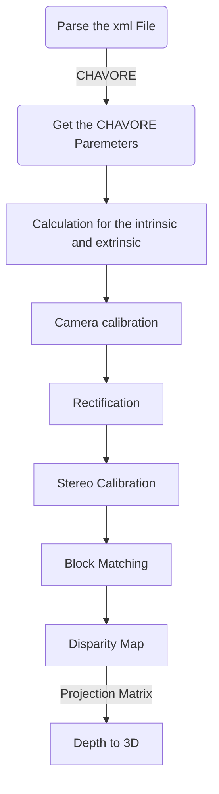

## Algorithm of the program

```mermaid
flowchart TD
A(Parse the xml File) -->|CHAVORE| B(Get the CHAVORE Paremeters)
B --> C[Calculation for the intrinsic and extrinsic]
C --> D[Camera calibration]
D --> E[Rectification]
E --> F[Stereo Calibration]
F --> G[Block Matching]
G --> H[Disparity Map]
H --> |Projection Matrix| I[Depth to 3D]
```
